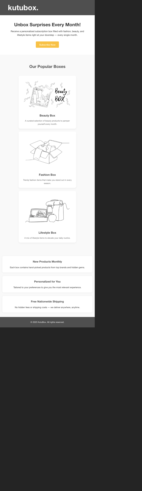

# 📦 Boxible Landing Page

A responsive landing page for a fictional subscription box service. Built with **React**, **SCSS**, and designed to be clean, modern, and mobile-friendly.

## 🌟 Features

- Clean and modern UI
- Responsive design
- SCSS variables and structure
- Hero section with CTA
- Product showcase section
- Feature highlights
- Footer section

## 📸 Preview



> Add a real screenshot here after taking one.

## 🚀 Getting Started

### 1. Clone the Repository

```bash
git clone https://github.com/busradogann/boxible-landing-page.git
cd boxible-landing-page

npm install

npm run dev


🛠 Built With
React

Vite

SCSS


boxible-landing-page/
├── public/
│   └── images/
├── src/
│   ├── App.jsx
│   ├── App.scss
│   └── assets/
└── index.html
